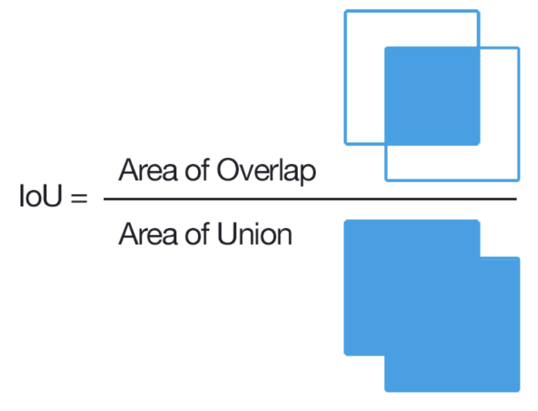
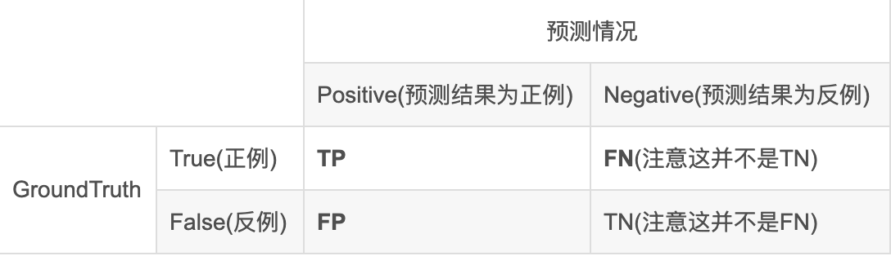
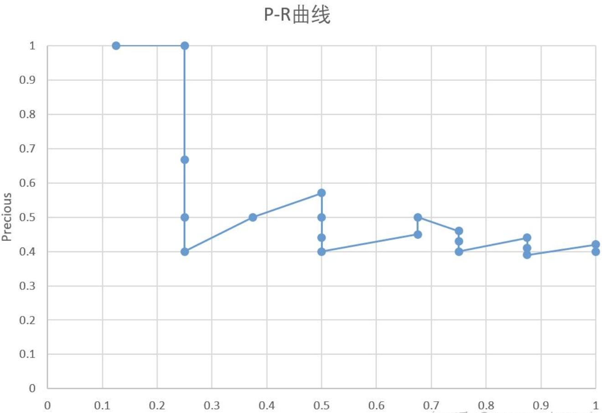
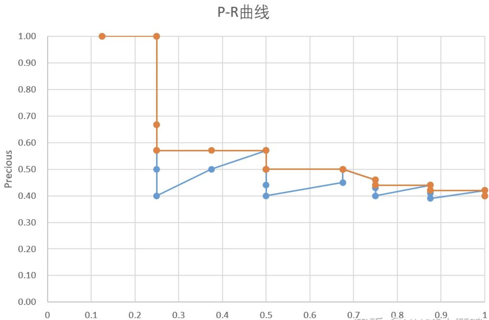
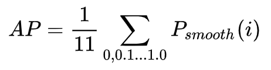

在目标检测中, 常见的两个评估指标有AP或者AR, 下图是coco官方的评估指标

  

### IoU(Intersection over Union)
- Intersection over Union是一种测量在特定数据集中检测相应物体准确度的一个标准。我们可以在很多物体检测挑战中，例如PASCAL VOC challenge中看多很多使用该标准的做法。

- IoU是一个简单的测量标准，只要是在输出中得出一个预测范围(bounding boxex)的任务都可以用IoU来进行测量。为了可以使IoU用于测量任意大小形状的物体检测，我们需要：
 - 1、ground-truth bounding boxes（人为在训练集图像中标出要检测物体的大概范围）；
 - 2、我们的算法得出的结果范围。

计算的公式为 实际预测的 bounding boxes和预测的Bounding boxes的交集除于他们的并集。如果IoU > 阈值则预测为真确, 如果IoU < 阈值则预测为错误。具体可以参考下图:

  

### Precision Recall
要理解mAP, 首先我们得了解准确率(Precision)和召回率(Recall). 下图是一个混淆矩阵

  

Recall   召回率（查全率）。表示正确识别物体A的个数占测试集中物体A的总个数的百分数，即所有正例中预测正确的概率，Recall = TP / (TP+FN)

Precision 精确率（查准率）。表示正确识别物体A的个数占总识别出的物体个数n的百分数，即预测为正例中预测正确的概率，Precision = TP / (TP+FP)

fp :false positive误报，即预测错误

fn :false negative漏报，即没有预测到

### PR图(Precision-Recall)
以Recall为横轴, Precision为纵轴, 我们就可以得到PR曲线。通常的P-R曲线如下:

  

### AP(Average Precision)
AP为平均精度, 使用积分的方式来计算PR曲线与坐标轴围成的面积。在实际应用中，我们不是去对其进行计算，而是对其平滑操作来简化计算，对PR曲线上的每个点，Precision的值取该点右侧最大的Precision的值.

  

计算出AP之后，对所有的类别的AP求平均就可以得出整个数据集上的mAP

### 目标检测中的mAP
不同的数据集给出不同的mAP的计算方法

检测出来的bbox包含score和bbox，按照score降序排序，所以每添加一个样本，就代表阈值降低一点（真实情况下score降低，iou不一定降低）。这样就是可以有很多种阈值，每个阈值情况下计算一个Precious和Recall。

使用区域选择算法得到候选区域
对候选区域，计算每一个候选区域和标定框（groud truth）的iou
设定一个iou阈值，大于这个的标为正样本，小于的标为负样本，由此得到一个类似于分类时的测试集。
将给定的测试集（正负样本），通过分类器，算出每一个图片是正样本的score
设定一个score阈值，大于等于此值的视作正样本，小于的作为正样本
根据上一步的结果可以算出准确率和召回率
调节score阈值，算出召回率从0到1时的准确率，通过计算所有类的AP就可以计算mAP了。

#### Interplolated AP（Pascal Voc 2008 的AP计算方式）
Pascal VOC 2008中设置IoU的阈值为0.5，如果一个目标被重复检测，则置信度最高的为正样本，另一个为负样本。在平滑处理的PR曲线上，取横轴0-1的10等分点（包括断点共11个点）的Precision的值，计算其平均值为最终AP的值。

  

#### MS COCO mAP
对于coco数据集来说，使用的也是Interplolated AP的计算方式。与Voc 2008不同的是，为了提高精度，在PR曲线上采样了100个点进行计算。而且Iou的阈值从 0.5 - 0.95 的区间上每隔0.05计算一次mAP的值，取所有结果的平均值作为最终的结果。除了AP，还有 [公式] , [公式] 等值，分别代表了如下含义

- mAP(mean Average precision)
  - AP % AP at IoU=0.50:0.05:0.95 (primary challenge metric)
  - APIoU=.50 % AP at IoU=0.50 (PASCAL VOC metric)IoU阈值为0.5时的AP测量值
  - APIoU=.75 % AP at IoU=0.75 (strict metric)IoU阈值为0.75时的测量值
- AP Across Scales:
  - APsmall % AP for small objects: area < 322像素面积小于 [公式] 的目标框的AP测量值（小尺度）
  - APmedium % AP for medium objects: 322 < area < 962 像素面积在[公式]- [公式]之间目标框的测量值（中等尺度）
  - APlarge % AP for large objects: area > 962 像素面积大于 [公式] 的目标框的AP测量值（大尺度）
  通常来说AP是在单个类别下的，mAP是AP值在所有类别下的均值。在这里，在coco的语境下AP便是mAP，这里的AP已经计算了所有类别下的平均值，这里的AP便是mAP。
- Average Recall (AR):
  - ARmax=1 % AR given 1 detection per image
  - ARmax=10 % AR given 10 detections per image
  - ARmax=100 % AR given 100 detections per image
- AR Across Scales:
  - ARsmall % AR for small objects: area < 322
  - ARmedium % AR for medium objects: 322 < area < 962
  - ARlarge % AR for large objects: area > 962

- 除非另有说明，否则AP和AR在多个交汇点（IoU）值上取平均值。具体来说，我们使用10个IoU阈值0.50：0.05：0.95。这是对传统的一个突破，其中AP是在一个单一的0.50的IoU上计算的（这对应于我们的度量APIoU=.50 ）。超过均值的IoUs能让探测器更好定位（Averaging over IoUs rewards detectors with better localization.）。

- AP是所有类别的平均值。传统上，这被称为“平均精确度”（mAP，mean average precision）。我们没有区分AP和mAP（同样是AR和mAR），并假定从上下文中可以清楚地看出差异。

- AP（所有10个IoU阈值和所有80个类别的平均值）将决定赢家。在考虑COCO性能时，这应该被认为是最重要的一个指标。

- 在COCO中，比大物体相比有更多的小物体。具体地说，大约41％的物体很小（面积<322），34％是中等（322 < area < 962)），24％大（area > 962）。测量的面积（area）是分割掩码（segmentation mask）中的像素数量。

- AR是在每个图像中检测到固定数量的最大召回（recall），在类别和IoU上平均。AR与提案评估（proposal evaluation）中使用的同名度量相关，但是按类别计算。

- 所有度量标准允许每个图像（在所有类别中）最多100个最高得分检测进行计算。

- 除了IoU计算（分别在框（box）或掩码（mask）上执行）之外，用边界框和分割掩码检测的评估度量在所有方面是相同的。

